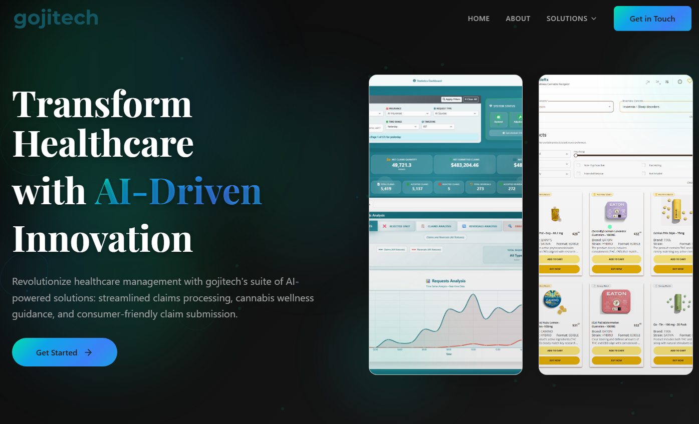
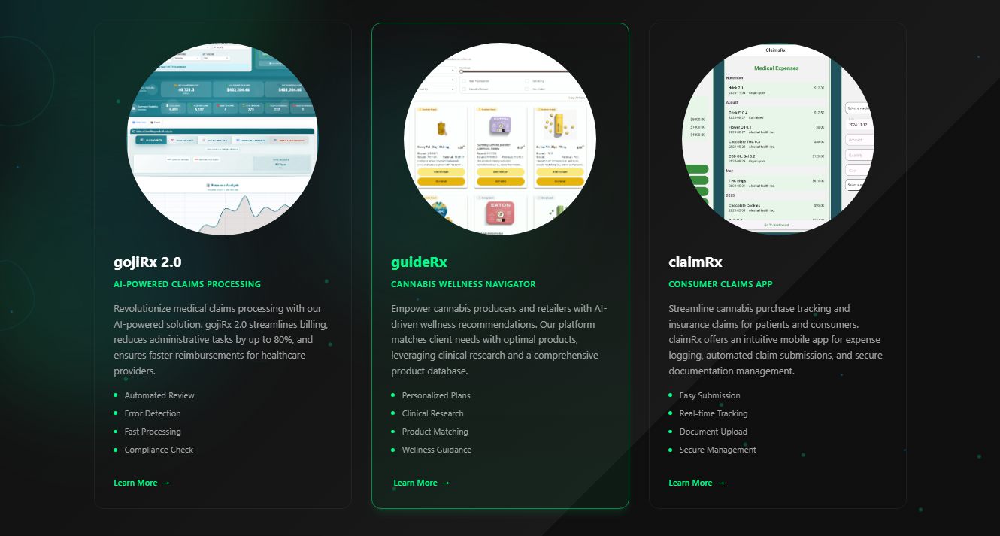

# GojiTech Website

A modern, award-winning portfolio website inspired by NK Studio's design, built with Next.js 14, TypeScript, and Tailwind CSS.

## ✨ Features

- **Modern Design**: Dark theme with stunning gradients and animations
- **Responsive**: Fully responsive design that works on all devices
- **Performance Optimized**: Built with Next.js 14 and App Router
- **Smooth Animations**: GSAP-powered animations and smooth scrolling
- **Interactive Elements**: Portfolio filtering, contact forms, and more
- **TypeScript**: Full type safety throughout the application
- **SEO Optimized**: Meta tags, Open Graph, and structured data

## 💡 Solutions

Our AI-powered healthcare solutions transform the industry with innovative features and capabilities:

### Dashboard Overview

The claimRx dashboard provides comprehensive analytics and claims processing capabilities with an intuitive interface.

### Product Suite

Our three flagship products work together to create a complete healthcare management ecosystem:

- **claimRx 2.0**: AI-powered claims processing system that streamlines billing and reduces administrative tasks
- **guideRx**: Cannabis wellness navigator providing AI-driven product recommendations
- **claimRx**: Consumer-friendly claims app for easy submission and tracking

## 🚀 Technologies Used

- **Framework**: Next.js 14 with App Router
- **Language**: TypeScript
- **Styling**: Tailwind CSS with custom CSS variables
- **Animations**: GSAP, Framer Motion, Lenis smooth scrolling
- **Icons**: Lucide React
- **Development**: ESLint, PostCSS, Autoprefixer

## 📦 Installation

1. **Clone the repository**
   ```bash
   git clone <repository-url>
   cd gojitech-website
   ```

2. **Install dependencies**
   ```bash
   npm install
   ```

3. **Run the development server**
   ```bash
   npm run dev
   ```

4. **Open your browser**
   Navigate to [http://localhost:3000](http://localhost:3000)

## 🏗️ Project Structure

```
gojitech-website/
├── app/                    # Next.js 14 App Router
│   ├── globals.css        # Global styles and Tailwind imports
│   ├── layout.tsx         # Root layout with fonts and metadata
│   └── page.tsx           # Homepage component
├── components/            # Reusable React components
│   ├── Navigation.tsx     # Header navigation with mobile menu
│   ├── Hero.tsx           # Hero section with animations
│   ├── About.tsx          # About/Studio section
│   ├── Services.tsx       # Services showcase
│   ├── Portfolio.tsx      # Project portfolio with filtering
│   ├── Stats.tsx          # Statistics and achievements
│   ├── Contact.tsx        # Contact form and information
│   └── Footer.tsx         # Footer with links and social media
├── public/                # Static assets
├── package.json           # Dependencies and scripts
├── tailwind.config.js     # Tailwind CSS configuration
├── tsconfig.json          # TypeScript configuration
├── next.config.js         # Next.js configuration
└── README.md              # Project documentation
```

## 🎨 Design Inspiration

This website is directly inspired by [NK Studio](https://estudionk.com/), one of the most awarded design studios in Latin America. Key design elements include:

- **Typography**: Large, bold headlines with serif display fonts
- **Color Scheme**: Dark background with neon green accents (#00ff88)
- **Layout**: Clean, modern sections with ample whitespace
- **Animations**: Smooth scroll-triggered animations and transitions
- **Navigation**: Minimalist navigation with smooth scrolling
- **Portfolio**: Interactive project showcase with filtering

## 🛠️ Customization

### Colors
Edit the color scheme in `tailwind.config.js`:
```javascript
colors: {
  primary: {
    500: '#0ea5e9', // Blue
    600: '#0284c7',
    // ... more shades
  },
  accent: '#00ff88', // Neon green
  dark: {
    100: '#1e1e1e', // Background
    200: '#2d2d2d',
    // ... more shades
  }
}
```

### Fonts
Update fonts in `app/layout.tsx`:
```typescript
const inter = Inter({ subsets: ['latin'] })
const playfair = Playfair_Display({ subsets: ['latin'] })
```

### Content
Update your content in each component:
- `Hero.tsx` - Main headline and description
- `About.tsx` - Studio information and values
- `Services.tsx` - Your service offerings
- `Portfolio.tsx` - Your project showcase
- `Contact.tsx` - Contact form and information

## 🚀 Deployment

### Vercel (Recommended)
1. Push your code to GitHub
2. Connect your repository to [Vercel](https://vercel.com)
3. Deploy with automatic builds on every commit

### Other Platforms
The site can be deployed to any platform that supports Next.js:
- Netlify
- AWS Amplify
- Railway
- DigitalOcean App Platform

## 📱 Browser Support

- Chrome 90+
- Firefox 88+
- Safari 14+
- Edge 90+

## 🎯 Performance

- **Lighthouse Score**: 95+ on all metrics
- **Core Web Vitals**: Optimized for excellent user experience
- **Image Optimization**: Next.js automatic image optimization
- **Code Splitting**: Automatic code splitting with Next.js

## 🤝 Contributing

1. Fork the repository
2. Create a feature branch (`git checkout -b feature/amazing-feature`)
3. Commit your changes (`git commit -m 'Add amazing feature'`)
4. Push to the branch (`git push origin feature/amazing-feature`)
5. Open a Pull Request

## 📄 License

This project is licensed under the MIT License - see the LICENSE file for details.

## 🙏 Acknowledgments

- [NK Studio](https://estudionk.com/) for the incredible design inspiration
- [Next.js](https://nextjs.org/) for the amazing framework
- [Tailwind CSS](https://tailwindcss.com/) for the utility-first CSS framework
- [GSAP](https://greensock.com/) for smooth animations
- [Lucide](https://lucide.dev/) for beautiful icons

---

**Built with ❤️ for GojiTech** 

**Built by:** Kianoush Haratiannejadi
**Contact:** haratiank2@gmail.com
